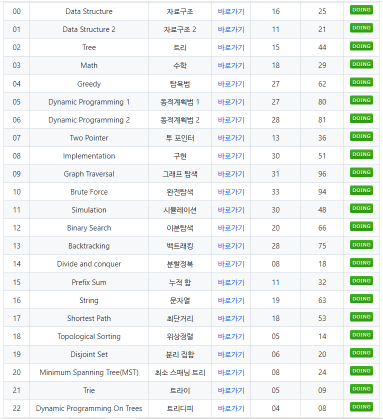

### 구미 3반 알고리즘 스터디

---

`김이랑` `김지현` `박경열` `이주영` 님이 참여 중인 알고리즘 문제 풀이 스터디 입니다.

- 현재 목표는 `BOJ 카테고리 별 문제풀이` 입니다.
  - https://github.com/tony9402/baekjoon

#### 스터디 방식

- 주 1회 (화요일 6시) 웹엑스를 이용해 스터디를 진행합니다.
- 매주 정해진 문제를 풀고(8 ~ 12문제) 스터디 시간에 풀이를 진행합니다.
  - 풀이 담당자는 이전 스터디 시간에 정해지며, 각 지정된 문제를 풀어와 풀이 방법을 공유합니다. 
  - 사다리 타기로 풀이할 사람을 지정합니다.
- 차주 스터디 문제는 스터디 시간에 논의를 통해 정해집니다.

#### 참여 방법

https://waytocse.tistory.com/59 글을 참고하세요!

- fork와 PR을 이용해 참여할 수 있습니다.

#### 규칙

- 파일, 소스코드 이름 규칙

  - 파일 이름은 `본인 이름`으로 작성해주세요

  - 소스코드명은`문제 출처_문제 번호` 로 작성해주세요

    - ex) `SWEA_1011`

  - 플랫폼 작성법

    - 백준 : `BOJ`

    - 삼성SW Expert Academy : `SWEA`

    - 프로그래머스 : `PRO`
    
      

- `commit` 규칙

  - 올리는 날짜를 포함해 commit 해주세요

    - ex) `220202`
    
    